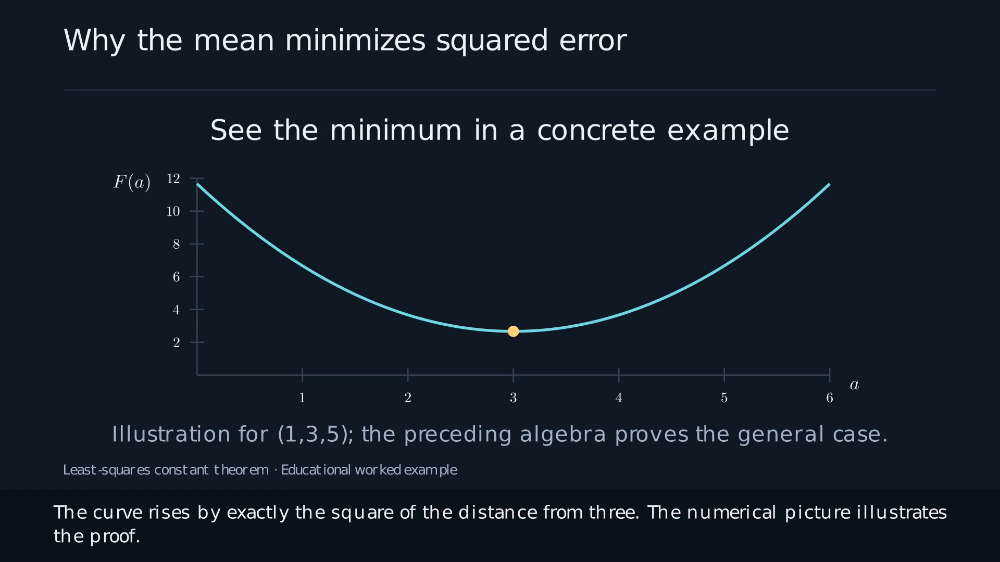

# Proof to Video

By **Bhaskar Krishnamachari** · BSD-3-Clause

A Codex plugin for turning a theorem or lemma into a carefully expanded,
narrated mathematical video for advanced undergraduates and beginning graduate
students.

Give Codex the paper, the result to explain, and any detailed companion guide,
appendix, or proof report. The plugin guides it through the derivation and
storyboard, then supplies a working pipeline for Manim animations, local Kokoro
speech, synchronized subtitles, chaptered video, and final review.

This is a reusable production workflow, not an automatic proof verifier. Codex
still has to understand the sources, justify the steps, write appropriate visual
code, and inspect the result. No particular paper, mathematical model, or cloud
speech service is required.

## Use it

```text
$proof-to-video Explain Theorem 2 in this paper for a senior undergraduate or
first-year graduate student. Use the attached expanded proof report and guide
for the intermediate details. Start with the necessary preliminaries, then
build a chaptered video with narration, animations, and subtitles. Include the
expanded proof, reproducible source, and a ZIP of the final video.
```

For a later visual correction:

```text
$proof-to-video Fix these notation errors in the video. Preserve the existing
narration, subtitle timings, and chapter boundaries. Check the repaired scenes
in the final encoded MP4 before delivering a corrected video ZIP.
```

## What it produces

| Stage | Artifact |
|---|---|
| Grounding | Exact result/version, source locations, companion-proof inventory |
| Mathematics | Prerequisites, expanded proof, source mapping, review and open issues |
| Teaching | Explicit narration sentences and a chaptered storyboard |
| Illustrations | Checked numerical examples, plots, or custom Manim animation code |
| Speech and timing | Cached sentence WAVs, sample-derived timeline, SRT/VTT |
| Rendering | 1080p H.264/AAC MP4 with chapters and burned captions |
| Review | Full-file media checks and initial/middle/final cue snapshots |
| Delivery | Video ZIP, source ZIP, transcript, chapters, and upload metadata |



The bundled independent example proves that the arithmetic mean is the unique
constant minimizing average squared error. It includes the complete elementary
proof, a number-line animation, a loss curve, and deterministic numerical checks.

## Install the skill from a checkout

Clone the public repository, then install:

```bash
git clone https://github.com/ANRGUSC/proof2video.git
cd proof2video
```

From the checkout, run:

```bash
python scripts/install_skill.py
```

This copies the self-contained skill and its helpers into
`~/.codex/skills/proof-to-video` (or `$CODEX_HOME/skills/proof-to-video`). It does
not overwrite an existing installation. Start a new Codex session and invoke
`$proof-to-video`. To install in an isolated location, use
`python scripts/install_skill.py --skills-dir /path/to/skills`.

The plugin manifest is at
`plugins/proof-to-video/.codex-plugin/plugin.json`; a repository-local marketplace
catalog is also included. Plugin-capable Codex clients can use this directory as
a plugin source. See [installation notes](docs/INSTALLATION.md) for the catalog
and the difference between a plugin installation and a standalone skill.

## Run the supplied example without Codex

The media pipeline can render an already-authored lesson independently:

```bash
conda env create -f environment.yml
conda activate proof-to-video
# Install LaTeX + dvisvgm or Poppler through your OS package manager.
# Download Kokoro model/voices separately as described below.
PV=plugins/proof-to-video/skills/proof-to-video/scripts/pv.py
python "$PV" doctor
python "$PV" init work/mean-example
python work/mean-example/simulation.py
python "$PV" audio work/mean-example --models /path/to/kokoro-models
python "$PV" render work/mean-example
python "$PV" verify work/mean-example
```

Inspect `work/mean-example/qa/review_*.jpg`, open the full-resolution frames,
and listen to the video. Only after those checks:

```bash
python "$PV" review work/mean-example --notes "Describe what you inspected, heard, and verified."
python "$PV" package work/mean-example
```

To record only the review actually completed, use `review --component visual`
or `review --component audio`. Packaging requires both; never mark listening
complete based only on waveform or transcription checks.

The outputs are in `work/mean-example/exports/`. `init` copies a reviewed example;
when adapting it to another theorem, replace the proof review and its hash with
a review of the new mathematical argument.

### Local speech

Use [kokoro-onnx](https://github.com/thewh1teagle/kokoro-onnx) with the two files
from its [model release](https://github.com/thewh1teagle/kokoro-onnx/releases/tag/model-files-v1.1):

- `kokoro-v1.0.onnx`
- `voices-v1.0.bin`

No speech API key is needed. Weights are downloaded separately and their hashes
are recorded. Default voice: `af_heart`, speed `0.90`; it is configurable. Speech
is cached by text, voice settings, engine version, and model hashes. Visual-only
edits reuse existing speech and encoded audio.

If TTS and Manim are installed in separate Python environments, pass
`--tts-python /path/to/tts-python` to `audio` and `doctor`.

## What the checks do and do not establish

The automated checks validate project structure, video decoding, codecs,
duration, frame count, chapters, and sentence timing. They do not prove a
mathematical theorem or replace visual/audio review. The renderer preserves
fraction bars, long overlines, and radical bars across the portable SVG pipeline;
the review still checks them in the actual MP4.

This release provides a chaptered master, built-in equation/number-line/polynomial
visuals, and project-local custom Manim hooks. Codex writes custom animations for
other mathematical structures. Word-level highlighting, alternative TTS backends,
and separate per-chapter MP4 export are extension points, not built-in promises.

## Develop and contribute

```bash
python -m unittest discover -s tests -v
python scripts/check_repository.py
```

Unit tests need NumPy and SoundFile. Rendering needs the full environment. See
[validation notes](docs/VALIDATION.md), [contribution guide](CONTRIBUTING.md), and
[provenance](PROVENANCE.md). The initial release is version 0.1.0.

Public source belongs in Git; generated MP4s, audio caches, and model weights do
not. Use release assets for example videos and source bundles. The plugin does
not upload to YouTube or create repositories automatically.

BSD-3-Clause. See [LICENSE](LICENSE) and [third-party notices](THIRD_PARTY_NOTICES.md).
