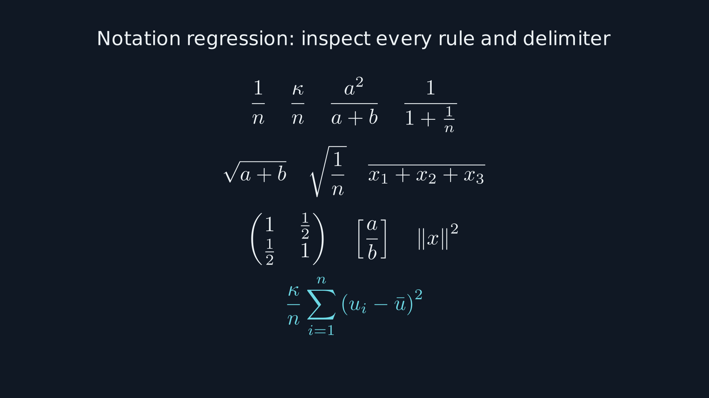

# Validation of version 0.1.0

For the subsequent Windows audit and release-hardening changes, see
[RELEASE_AUDIT.md](RELEASE_AUDIT.md). The results below describe the original
Linux validation and are retained as historical evidence.

The initial implementation was exercised on Linux on 12 September 2026 using
Manim Community 0.20.1, local kokoro-onnx 0.6.1, FFmpeg, pdfLaTeX, and Poppler.
The TTS and renderer used separate Python environments. The supplied environment
file is a reproducibility starting point; a clean install on every operating
system has not been tested.

## Completed checks

- All 11 unit/regression tests pass. They cover confined project paths, chapter
  ordering, invalid speech settings, stale timelines, unresolved proof gates,
  caption timestamps, visible SVG rule geometry, and unsupported SVG paths.
- A cached-audio regression actually rebuilds WAV/timeline outputs after an
  equation-only change and confirms identical audio and timing with no synthesis.
- A visual-review-only regression confirms that it cannot claim listening or
  unlock final video packaging.
- Repository, Codex plugin manifest, and skill validators pass.
- The standalone installer was exercised in an isolated skill directory, and the
  installed command successfully validated a lesson. Client UI installation and
  arbitrary end-to-end Codex behavior have not been tested.
- The bundled least-squares example passes 100 deterministic numerical checks,
  including the one-element case. This supports the illustration; its expanded
  algebraic proof establishes the theorem.
- The example generated 16 local speech clips, a 110.1-second chaptered video,
  SRT/VTT, a transcript, and a reproducible timeline at 1080p and 30 fps.
- Automated full-video decoding, frame count, codecs, chapters, fast-start, and
  sentence-onset checks pass. Visual snapshots are extracted at three times per
  cue. Measured onset rounding is at most half a video frame.
- A separate 1080p notation scene was visually inspected: simple/nested/colored
  fractions, radicals, long overlines, summation indices, norms, and matrix
  delimiters render correctly. See the image below. The example's encoded-video
  snapshots also show the fraction bars correctly.



## Review limits

The mathematical exposition and frames were reviewed with model assistance.
This is not Lean verification. A 110-second elementary example does not establish
that the authoring skill handles every research proof correctly.

No audio-listening capability was available during this release check. Audio was
synthesized and structurally checked, but listening review of the example remains
pending. Its report records that honestly; it is a development demonstration,
not a fully reviewed release video. The public source can be installed and used;
users should listen before distributing their own generated videos. The pipeline
requires both visual and listening attestations before final video packaging.

The separate notation image is a static rendering check, not an encoded-video
check for every symbol. Every new project must inspect its actual exported MP4,
including moving/revealed states and mathematical bars.

## Re-run

Run the tests and repository checker in the README, then render and verify the
bundled example. For the additional notation image:

```bash
export PYTHONPATH="$PWD/plugins/proof-to-video/skills/proof-to-video/scripts"
python -m manim -qh -s --media_dir /tmp/proof-video-notation tests/notation_smoke.py NotationSmoke
```

The notation test writes reproducible temporary render output. Inspect it; no
pixel-perfect or mathematical assertion is inferred from successful rendering.
